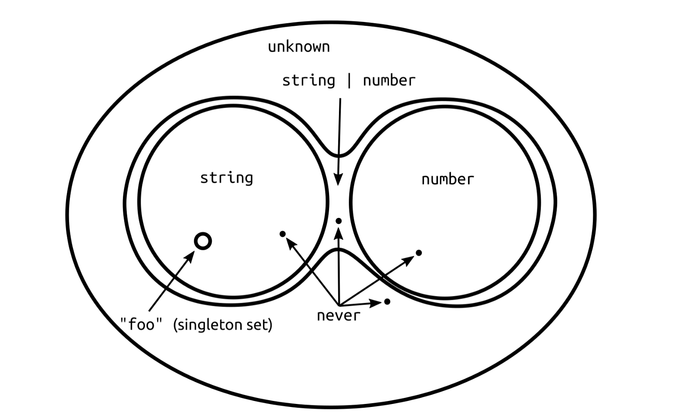

# any, unknown 그리고 never

### any 라는 마법

타입은 기본적으로 가능한 값들의 집합의 개념이다. 예를 들어서 
```ts
let x: string = 'a';
x = 'bc';
x = 3; //error
```
`string` 타입에 `number` 를 할당하지 못한다. 왜냐하면 `string`과 `number` 는 완전히 다른 집합이기 떄문이다. 

그렇다면 `any` 타입은 어떤 의미를 가질까?
```ts
let: x: any = 'a';
x = 'bc';
x = 3; // pass
```
`string` 이 문자열을 가질 수 있는 값들의 집합인 것을 감안한다면 위 예시에서 `any` 타입은 변수에 할당할 수 있는 모든 값들의 집합을 의미한다.

`any` 타입이 무척이나 편해보여서 좋아보인다. 하지만 모든 타입을 `any` 로 설정해 둔다면 TS를 사용하는 이유가 사라지게 된다. 그래서 특정 상황이 아니라면 `any` 타입을 사용하는 것이 추천되지 않는다.

### any 의 대용 : unknown


unknown은 위 그림과 같이 모든 타입의 `top` 값이다. 그렇다면 `any` 와의 차이점은 무엇이고 어떤 특징 때문에 `any`의 대용이라고 설명했을까?

`unknown`은 기본적으로 `any`와 유사하다. 모든 타입의 super type 이어서 모든 값을 `unknown`에 할당이 가능하다. 여기까지는 `any` 타입과 동일하다.

`any` 타입은 기본적으로 타입 체킹을 건너뛴다는 의미를 내포하고 있다.
```ts
function someFunc(a: any) {
  ...
}

someFunc();
```
위 코드를 작성할 시점에는 에러가 발생하지 않는다. 하지만 실행을 해보면 에러를 발생한다.

```ts
function someFunc(a: unknown) {
  ...
}

someFunc();
```
위 코드를 작성해보면 코드를 적는 시점에 에러가 발생할 것이다. `unknown`은 `any` 와 다르게 타입 체킹을 강제하는 효과가 있다.

다음의 예시를 보자
```ts
let value: any;

value = true; // OK
value = 42; // OK
value = "Hello World"; // OK
value = []; // OK
value = {}; // OK
value = Math.random; // OK
value = null; // OK
value = undefined; // OK
value = new TypeError(); // OK
value = Symbol("type"); // OK
```
`any` 타입에 어떤 값을 할당하던 상관이 없는 모습이다.
이는 전혀 문제가 없는 코드로 보인다. 그러면 다음 예시로 넘어가보자

```ts
let value: any;

value.foo.bar; // OK
value.trim(); // OK
value(); // OK
new value(); // OK
value[0][1]; // OK
```
이 코드에 에러가 나지 않으면 문제가 있어보인다. `value`는 선언만 되어있고 어떠한 값으로 정의되지 않았다. 하지만 `value`에 속성이 있는 것 처럼 접근하거나 메소드 또는 인덱스에 접근하면 에러가 발생하지 않는다. 위와 같은 코드는 작성시에는 아무런 문제가 없다가 런타임에 에러를 발생시켜 서비스를 먹통으로 만들 수 있다.

그렇다면 `unknown`은 어떨까?
```ts
let value: unknown;

value = true; // OK
value = 42; // OK
value = "Hello World"; // OK
value = []; // OK
value = {}; // OK
value = Math.random; // OK
value = null; // OK
value = undefined; // OK
value = new TypeError(); // OK
value = Symbol("type"); // OK
```
모든 값이 할당가능한 모습이다. 이 또한 문제가 없어보인다.

```ts
let value: unknown;

let value1: unknown = value; // OK
let value2: any = value; // OK
let value3: boolean = value; // Error
let value4: number = value; // Error
let value5: string = value; // Error
let value6: object = value; // Error
let value7: any[] = value; // Error
let value8: Function = value; // Error
```

`any` 를 다른 타입에 할당했을 때 문제가 되지 않았지만 `unknown`은 `any` 또는 `unknown` 타입에만 할당을 해야한다. 왜냐하면 `any`는 타입 체킹을 무시하고 할당해서 코드 작성 시에는 에러가 발생하지 않지만 `unknown` 타입은 타입 체킹을 하기 때문에 코드 작성시 에러가 발생하는 것이다.

```ts
let value: unknown;

value.foo.bar; // Error
value.trim(); // Error
value(); // Error
new value(); // Error
value[0][1]; // Error
```
이 코드 또한 `unknown` 타입에서는 불가능하다. `value` 가 정의되지 않았으므로 어떠한 속성, 메소드, 인덱스, 호출, 생성자 호출도 불가능하다.


```ts
function someFunc(value: unknown) {
  if(typeof value === 'function'){
    ...
  }
}
```
앞에서 본 예시에 의하면 `unknown` 타입을 사용했을 때는 타입을 추론해줄 필요가 있다. `unknown` 타입을 사용하려면 특정한 타입으로 타입을 좁혀주어야 좁혀진 타입에 따른 동작을 수행할 수 있기 때문이다.